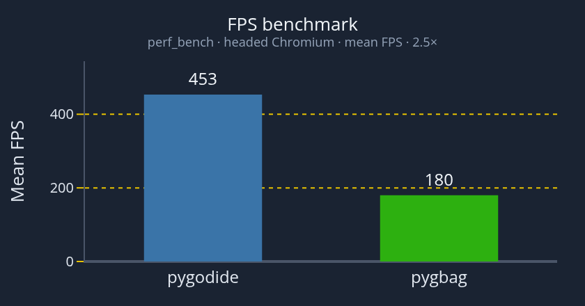

<h1 align="left">
  
</h1>

[](https://pypi.org/project/pygodide/)
[](https://pypi.org/project/pygodide/)
[](https://pepy.tech/projects/pygodide)
[](https://github.com/Elan456/pygodide/actions/workflows/ci.yml)
[](LICENSE)

[](https://elan456.github.io/pygodide/)
[](https://github.com/astral-sh/ruff)

**pygodide** turns Pygame projects into browser apps
using [Pyodide](https://pyodide.org/) with one command, no edits to your source code, and achieving [2.5x more fps than pygbag](https://elan456.github.io/pygodide/benchmark/).

> Pronounced "pie-go-died"

<p align="left">
  <a href="https://elan456.github.io/pygodide/benchmark/">
    
  </a>
</p>

<p align="left">
  <sub>FPS Performance Benchmark |
  <a href="https://elan456.github.io/pygodide/benchmark/">Full Benchmark</a></sub>
</p>

If anything doesn't work out-of-the-box, pygodide offers tons of configuration options to adapt to your needs.

**Documentation**: [https://elan456.github.io/pygodide/](https://elan456.github.io/pygodide/)

## Quick Start

While in your project's root directory, run the following commands:

### Install

```bash
# Or add to your pyproject.toml and `uv sync`
pip install pygodide
```

### Build

```bash
# Produces the web-hostable build/ directory
pygodide build .

# For an Itch.io zip file
pygodide build . --zip
```

### Serve

```bash
# Hosts the build/ directory locally
pygodide serve .
```

Open [http://localhost:8000](http://localhost:8000) in your browser.

### Troubleshooting

If anything went wrong, head over to the [instructions](https://elan456.github.io/pygodide/instructions/) page for more details and troubleshooting guidance.

## Examples and Live Demos

Sample projects live under
[`test_targets/`](https://github.com/Elan456/pygodide/tree/main/test_targets) and a few of them are uploaded to `itch.io`.

Numpy particles demo: https://elan456.itch.io/pygodide-test-project  
Audio demo: https://elan456.itch.io/pygodide-audio-demo  
Arcade performance benchmark: https://elan456.itch.io/pygodide-performance-benchmark

Try one locally:

```bash
pygodide build test_targets/ball_bouncing
pygodide serve test_targets/ball_bouncing
```

Before every release, each target under `test_targets/` is automatically verified using a headless browser to catch regressions. All features shown in the test targets are maintained as first-class features.

## Contributing

```bash
git clone https://github.com/Elan456/pygodide.git
cd pygodide
uv sync --dev
uv run playwright install chromium
uv run pre-commit install --hook-type pre-commit --hook-type pre-push
```

The `dev` group includes `pygodide[smoke]`, so Playwright is installed with
`uv sync --dev`. You still need `playwright install chromium` once for browser
binaries.

Run the same checks as CI:

```bash
uv run ruff format --check .
uv run ruff check .
uv run pytest
```

### Smoke tests (from this repo)

```bash
uv run playwright install chromium   # once
uv run pygodide smoke /path/to/your/pygame/project
uv run pygodide smoke test_targets --suite
```

Be sure to read the `AGENTS.md` it's written for both human contributors as well as AI tools.