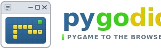

<h1 align="left" markdown="0">
  
</h1>

**pygodide** turns Pygame projects into browser apps using [Pyodide](https://pyodide.org/).
It bundles your code and assets, installs Python dependencies in the browser, and
generates the HTML and JavaScript needed to run your game on the web.

## Performance

On the [`perf_bench`](https://github.com/Elan456/pygodide/tree/main/test_targets/perf_bench)
workload, a reference run reported **433 FPS** in pygodide vs **180 FPS** in
pygbag (headed Chromium; local desktop **950 FPS**).

<div class="benchmark-chart-frame" markdown="0">
<iframe
  src="assets/benchmark-chart.html"
  title="FPS benchmark"
  loading="lazy"
></iframe>
</div>

[Full benchmark details](benchmark.md) · [Reproduce locally](benchmark.md#reproduce-locally)

## Install

```bash
pip install pygodide
```

For `pygodide smoke` (headless browser check), install the smoke extra and
Chromium once:

```bash
pip install 'pygodide[smoke]'
playwright install chromium
```

Then run `pygodide smoke .` from your game project. See
[smoke testing](instructions.md#check-your-build-with-a-smoke-test) for the full
flow.

## Get started in 30 seconds

From your project root:

```bash
pygodide build .
pygodide serve .
```

Open [http://localhost:8000](http://localhost:8000) in your browser.

Pygodide looks for `main()` in `main.py`, reads dependencies from
`requirements.txt` or `pyproject.toml`, and auto-converts simple game loops for
the browser. That covers most small projects without extra setup.

When it works, your game is a normal web page: easy to host, link, and share.
`pygodide build . --zip` produces an itch.io-ready upload if you want to reach
more players without a separate web port. See
[Publishing to itch.io](instructions.md#publishing-to-itchio) in the instructions.

## Need more help?

See the **[Instructions](instructions.md)** guide for:

- troubleshooting when the quick start does not work
- setting a custom entry point or dependencies
- making your game async-compatible
- running `pygodide smoke` to check a build before debugging in the browser

For the full flag list generated from the CLI source, see the
**[CLI reference](cli.md)**.

## Common commands

| Command | What it does |
| --- | --- |
| `pygodide build .` | Bundle your project into `build/` |
| `pygodide serve .` | Serve the built app locally (default port `8000`) |
| `pygodide serve . --port 3000` | Serve on a different port |
| `pygodide smoke .` | Build and test in a headless browser |
| `pygodide build . --app game:start` | Use a different entry function |
| `pygodide build . --dep numpy` | Add an extra dependency for this build |
| `pygodide build . --zip` | Build and create an itch.io-ready ZIP |

Build output is logged to `build/pygodide-build.log`. Smoke tests also write
`build/pygodide-smoke.log`.

## Examples

Working sample projects live in the
[test_targets](https://github.com/Elan456/pygodide/tree/main/test_targets)
directory on GitHub, including:

- [ball bouncing](https://github.com/Elan456/pygodide/tree/main/test_targets/ball_bouncing): minimal async Pygame game
- [not async](https://github.com/Elan456/pygodide/tree/main/test_targets/not_async): sync loop converted automatically at build time
- [numpy particles](https://github.com/Elan456/pygodide/tree/main/test_targets/numpy_particles): larger game with extra dependencies
- [save slots](https://github.com/Elan456/pygodide/tree/main/test_targets/save_slots): create and load JSON save files from the game

## Live demos

A few of those fixtures are also hosted on [itch.io](https://elan456.itch.io):

<div class="itch-demo-list" markdown="0">
  <iframe
    frameborder="0"
    src="https://itch.io/embed/4748245"
    width="552"
    height="167"
    loading="lazy"
    title="Pygodide Numpy + Fastquadtree Test"
  ><a href="https://elan456.itch.io/pygodide-test-project">Pygodide Numpy + Fastquadtree Test by Elan456</a></iframe>
  <iframe
    frameborder="0"
    src="https://itch.io/embed/4759303"
    width="552"
    height="167"
    loading="lazy"
    title="Pygodide Audio Demo"
  ><a href="https://elan456.itch.io/pygodide-audio-demo">Pygodide Audio Demo by Elan456</a></iframe>
  <iframe
    frameborder="0"
    src="https://itch.io/embed/4772138"
    width="552"
    height="167"
    loading="lazy"
    title="Pygodide Performance Benchmark"
  ><a href="https://elan456.itch.io/pygodide-performance-benchmark">Pygodide Performance Benchmark by Elan456</a></iframe>
</div>